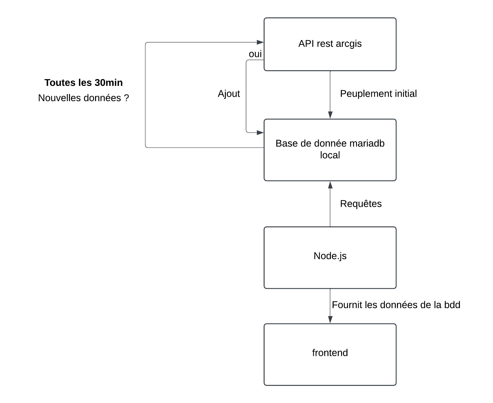

# Rapport du projet ATMO

## Contexte

Le piton de la Fournaise entre en éruption régulièrement ce qui peut provoquer des forts dégazages entrainant des pics de pollution en SO2 qui impact la population de la Réunion.

## Objectif 

Le but est de produire une page web avec une carte de la Réunion. Sur cette carte on affiche la concentration SO2 par site ou un capteur est présent.

## L'API arcgis

Afin de récupérer les données des points que nous allons afficher sur notre carte, nous utilisons l'api de opendata arcgis :

```
https://data-atmoreunion.opendata.arcgis.com/datasets/fb7de41b80534777808df9212d78197f_0/api
```
Les données sur l'API sont mises à jour toutes les heures.

## La stack



### API - BDD
On utilise l'API initialement pour peupler notre base de donnée mariadb local. Ensuite, sachant que les données des capteurs sont colléctées par heure, on vérifie, toute les 30 minutes, si la base de donnée local est à jour par rapport à ce que l'API renvoie. Pour se faire, on regarde si l'API renvoie des données à un timestamp supérieur au plus grand timestamp de notre base de donnée local.

### Node.js - BDD
On utilise ensuite Node.js comme interface entre notre base de données et le serveur python (http.server) qui délivre notre frontend. C'est au travers des endpoints définit dans notre server node.js qu'on fait les requetes SQL vers notre base de donnée.


### Ports
Le server python et le node.js tournent localement sur les ports 8000 et 3000 respectivement


